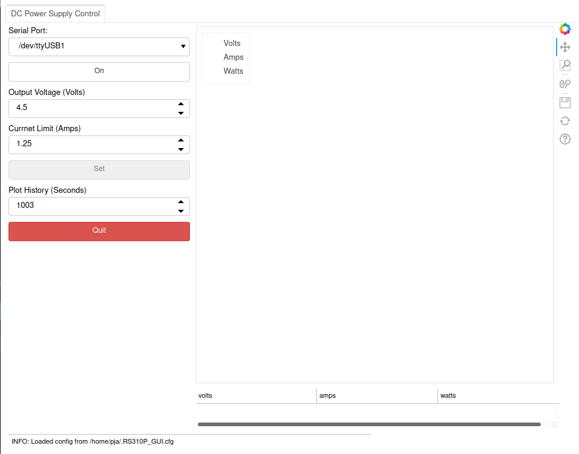
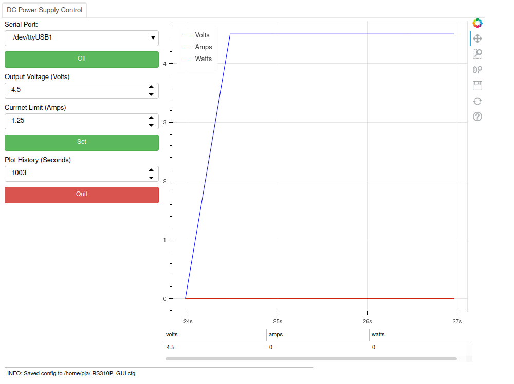
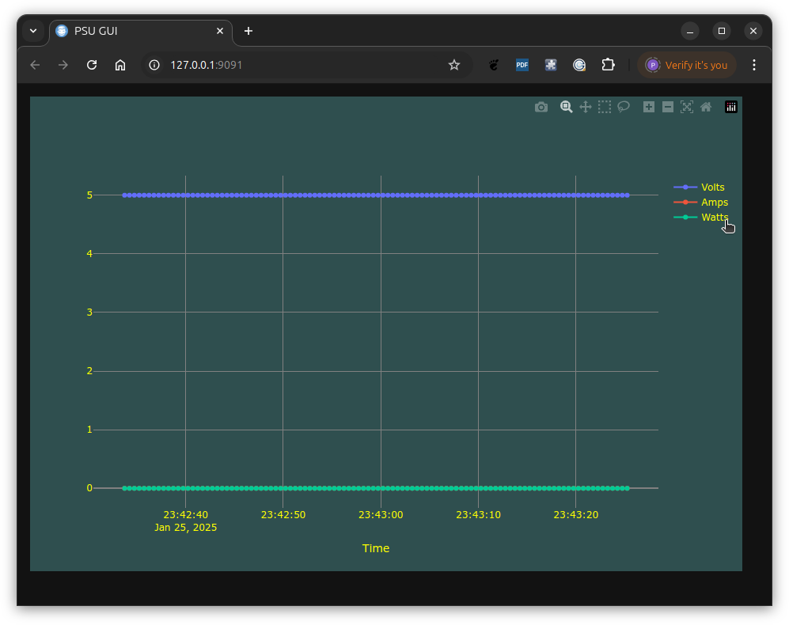
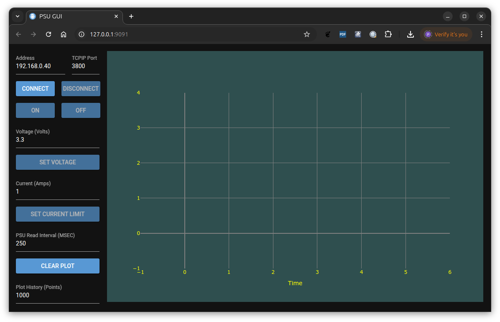

# ROCKSEED RS310P PSU control
This project provides a command line and gui tool to control the ETommens eTM-xxxxP Series DC power supply (PSU).
Several manufacturers use this supply, Hanmatek HM305P, Rockseed RS305P, Hanmatek HM310P, RockSeed RS310P,
Rockseed RS605P. See https://sigrok.org/wiki/ETommens_eTM-xxxxP_Series#Protocol for more details.

Version 1.9 represents a significant change to the code base primarily to

- The tool will now run on Linux and Windows platforms.
- Update GUI to use the nicegui module rather than bokeh as this provides a
  cleaner user interface.
- Update to use the latest pymodbus python module to make it easier for
  developers to use the psu interface.

# Installation
The installers folder contains the installers for Linux and Windows systems.

## Linux installation
- Ensure pipx is installed. Details of how pipx is installed can be found [here](https://pipx.pypa.io/latest/installation/).
- The following command will install the rs310p_dc_psu package onto a Linux machine (the version in the filename may change) from a terminal window.

```
pipx install installers/rs310p_dc_psu-1.8-py3-none-any.whl
  installed package rs310p-dc-psu 1.8, installed using Python 3.12.3
  These apps are now globally available
    - psu
done! ✨ 🌟 ✨
```

To uninstall the package the following command can be used.

```
pipx uninstall rs310p_dc_psu
uninstalled rs310p-dc-psu! ✨ 🌟 ✨
```

## Windows installation
- Ensure python3.12 is installed on the Windows machine from the Microsoft Store.
- Double click on the installers/rs310p-dc-psu_1.8.exe file. This will start a windows installer dialog, step through this to install the application. Part way through the installation a command shell window will appear. When complete click the Finish button.

When complete the following will be available in the start menu

- rs310p_dc_psu
- rs310p_dc_psu Shell

The first will start the GUI which may take several seconds to start. The second will open a command prompt to allow you to use the command line interface.

## Using the GUI interface
The PC (Linux or Windows) must be connected to the PSU via a USB cable.

### Linux
To open the GUI interface on a Linux platform you should open a terminal window and enter

```
psu -g
```

### Windows
To open the GUI interface on a Windows platform you should select rs310p_dc_psu option from the start menu.


On both Linux and Windows platforms this will open a browser window as shown below if the power supply is connected and powered up.



You may then select the serial port that is connected to the PSU and then select the CONNECT button to connect to the PSU.



The above image shows the status being read from the PSU and being updated in the plot area. The controls on the
left hand side of the page allow you to turn the output power on/off, set the voltage, set the current limit, set the update period for the plotted status, clear the plot area and set the maximum number of plot point displayed in the plot area. Once the maximum number of plot points is reached older points will slide off the left hand side of the plot.


## Using the Command line interface
The PC (Linux or Windows) must be connected to the PSU via a USB cable.

### Linux
To access the command line interface help text on a Linux platform open a terminal window and enter the following command

```
psu -h
usage: psu [-h] [-d] [-p P] [-v V] [-a A] [-s] [--vs] [--ov OV] [--oa OA] [--op OP] [--on] [--off] [--bon] [--boff] [--poll POLL] [--log LOG] [-g] [-w WIDTH] [--plot] [--plotl] [--address ADDRESS]
           [-r]

Provide a control interface to the ROCKSEED RS310P/RS305P Bench PSU.

options:
  -h, --help            show this help message and exit
  -d, --debug           Enable debugging.
  -p P                  The local machine USB serial port connected to the PSU (default=/dev/ttyUSB0) or the 'host:port' format for an Esp-Link bridge.
  -v V                  The required output voltage.
  -a A                  The current limit value in amps.
  -s                    The PSU status showing output state, voltage, current and power out.
  --vs                  The verbose PSU status.
  --ov OV               The required over voltage protection value in volts
  --oa OA               The required over current protection value in amps.
  --op OP               The required over power protection value in watts.
  --on                  Turn the PSU output on.
  --off                 Turn the PSU output off.
  --bon                 Set the buzzer on.
  --boff                Set the buzzer off.
  --poll POLL           The poll period in seconds (default=1).
  --log LOG             Log file. This is used when plotting (default=/tmp/psu.log).
  -g                    Run the GUI.
  -w WIDTH, --width WIDTH
                        The browser window width. The plot is scaled to fit the preferred window size (default=1100).
  --plot                Plot the PSU status.
  --plotl               Plot the data in the log file.
  --address ADDRESS     The address to which the GUI server is bound. By default 127.0.0.1 (localhost) is used which means the GUI is only reachable from this machine. You may set this to an IP
                        address of an interface on this machine if you wish to make the GUI available to other machines that have network connectivity to this machine.
  -r, --reload          Enable the nicegui reload functionality. Useful during development.
```

For example, to set the output voltage to 5 volts and turn on the PSU the following command could be used, assuming the /dev/ttyUSB0 serial port is the port connected to the PSU.

```
psu -p /dev/ttyUSB0 -v 5 --on
INFO:  Set output to 5.00 Volts
INFO:  Set output ON
```

### Windows
On a Windows platform the 'rs310p_dc_psu Shell' start menu option should be used to open a powershell terminal window.

The command line help can be accessed in a similar manner to a Linux system as shown below

```
PS C:\Python_Program_Files\rs310p-dc-psu> .\psu.bat -h

C:\Python_Program_Files\rs310p-dc-psu>cd "C:\Python_Program_Files\rs310p-dc-psu"

C:\Python_Program_Files\rs310p-dc-psu>python -m poetry run python -c "import rs310p_dc_psu.psu; rs310p_dc_psu.psu.main()" -h
usage: -c [-h] [-d] [-p P] [-v V] [-a A] [-s] [--vs] [--ov OV] [--oa OA] [--op OP] [--on] [--off] [--bon] [--boff]
          [--poll POLL] [--log LOG] [-g] [-w WIDTH] [--plot] [--plotl] [--address ADDRESS] [-r]

Provide a control interface to the ROCKSEED RS310P/RS305P Bench PSU.

options:
  -h, --help            show this help message and exit
  -d, --debug           Enable debugging.
  -p P                  The local machine USB serial port connected to the PSU (default=/dev/ttyUSB0) or the
                        'host:port' format for an Esp-Link bridge.
  -v V                  The required output voltage.
  -a A                  The current limit value in amps.
  -s                    The PSU status showing output state, voltage, current and power out.
  --vs                  The verbose PSU status.
  --ov OV               The required over voltage protection value in volts
  --oa OA               The required over current protection value in amps.
  --op OP               The required over power protection value in watts.
  --on                  Turn the PSU output on.
  --off                 Turn the PSU output off.
  --bon                 Set the buzzer on.
  --boff                Set the buzzer off.
  --poll POLL           The poll period in seconds (default=1).
  --log LOG             Log file. This is used when plotting (default=C:\Users\pja\AppData\Local\Temp\psu.log).
  -g                    Run the GUI.
  -w WIDTH, --width WIDTH
                        The browser window width. The plot is scaled to fit the preferred window size (default=1100).
  --plot                Plot the PSU status.
  --plotl               Plot the data in the log file.
  --address ADDRESS     The address to which the GUI server is bound. By default 127.0.0.1 (localhost) is used which
                        means the GUI is only reachable from this machine. You may set this to an IP address of an
                        interface on this machine if you wish to make the GUI available to other machines that have
                        network connectivity to this machine.
  -r, --reload          Enable the nicegui reload functionality. Useful during development.
PS C:\Python_Program_Files\rs310p-dc-psu>
```

Similarly to set the output voltage to 5 volts and turn on the PSU the following command could be used, assuming the COM8 serial port is the port connected to the PSU.


```
PS C:\Python_Program_Files\rs310p-dc-psu> .\psu.bat -p COM8 -v 5 --on

C:\Python_Program_Files\rs310p-dc-psu>cd "C:\Python_Program_Files\rs310p-dc-psu"

C:\Python_Program_Files\rs310p-dc-psu>python -m poetry run python -c "import rs310p_dc_psu.psu; rs310p_dc_psu.psu.main()" -p COM8 -v 5 --on
INFO:  Set output to 5.00 Volts
INFO:  Set output ON
PS C:\Python_Program_Files\rs310p-dc-psu>
```

### Recording data to a log file
For purposes of this example the Linux command line is used. Similar commands can be used on Windows platforms.

If the --poll command line interface is used then data can be recorded to a log file.

```
psu -p /dev/ttyUSB0 --poll .5
INPUT: Overwrite /tmp/psu.log y/n: : y
INFO:  Deleted /tmp/psu.log
INFO:  Created /tmp/psu.log
INFO:  Log file: /tmp/psu.log
INFO:  25/01/2025-23:35:34.336899: Volts=5.0 Amps=0.0 Watts=0
INFO:  25/01/2025-23:35:34.836677: Volts=5.0 Amps=0.0 Watts=0
INFO:  25/01/2025-23:35:35.336505: Volts=5.0 Amps=0.0 Watts=0
INFO:  25/01/2025-23:35:35.832465: Volts=5.0 Amps=0.0 Watts=0
INFO:  25/01/2025-23:35:36.332653: Volts=5.0 Amps=0.0 Watts=0
INFO:  25/01/2025-23:35:36.832792: Volts=5.0 Amps=0.0 Watts=0
INFO:  25/01/2025-23:35:37.333014: Volts=5.0 Amps=0.0 Watts=0
INFO:  25/01/2025-23:35:37.834439: Volts=5.0 Amps=0.0 Watts=0
INFO:  25/01/2025-23:35:38.333011: Volts=5.0 Amps=0.0 Watts=0
INFO:  25/01/2025-23:35:38.833237: Volts=5.0 Amps=0.0 Watts=0
INFO:  25/01/2025-23:35:39.333277: Volts=5.0 Amps=0.0 Watts=0
```

### Plotting the data from a log file
To plot the data from a log file the --plotl command line argument can be used as shown below.

```
psu --plotl
INFO:  Loaded 104 readings from the /tmp/psu.log file.
Close this to shutdown GUI server.
NiceGUI ready to go on http://localhost:9091
```




### Connecting to a remote serial port
The GUI can be started started when the port is defined as an address:port pair if the PSU is connected to an ESP Link Bridge then the GUI shows the address:port rather than a pull down menu of local serial ports as shown Below.

```
psu -g -p 192.168.0.40:3800
```



The user can change the address or serial port from the default values set on the command line.
Flaviu Tamas has detailed how an ESP link bridge may be used to provide remote access to the
PSU. See https://flaviutamas.com/2023/rs310p-wifi-mod for details of this.


# Thanks
Thanks to all those who have contributed to this project including.

Flaviu Tamas
