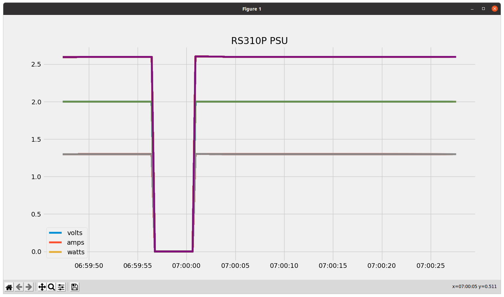

# ROCKSEED RS310P PSU control
This project provides a command line tool to control the
ETommens eTM-xxxxP Series PSU. Several Mfg's use this supply,
Hanmatek HM305P, Rockseed RS305P, Hanmatek HM310P, RockSeed RS310P,
Rockseed RS605P. See https://sigrok.org/wiki/ETommens_eTM-xxxxP_Series#Protocol for more details. The tool is written in python.

# Installation
Currently an installer is available for Linux systems. The python code should run on Windows but has not been tested and no installer currently exists for a Windows platform.

## Installing the debian package
- Download the packages/python-rs3psu-1.1-all.deb. The version (currently 1.1) of the package may change.
- Install the package from a terminal window on your machine as shown below.
```
sudo dpkg -i python-rs3psu-1.1-all.deb
```

## Installing the RPM package
- Download the packages/python-rs3psu-1.1-2.noarch.rpm. The version (currently 1.1) of the package may change.
- Install the package from a terminal window on your machine as shown below.
```
sudo rpm -Uvh python-rs3psu-1.1-2.noarch.rpm
```


#Running the psu command
Once installed the psu command is available on the command line. The psu command has command line help as shown below

```
psu -h
Usage: Provide a control interface to the ROCKSEED RS310P/RS305P Bench PSU.

Options:
  -h, --help  show this help message and exit
  --debug     Enable debugging.
  -p P        Serial port (default=/dev/ttyUSB0).
  -v V        The required output voltage.
  -a A        The current limit value in amps.
  -s          The PSU status showing output state, voltage, current and power
              out.
  --vs        The verbose PSU status.
  --ov=OV     The required over voltage protection value in volts
  --oa=OA     The required over current protection value in amps.
  --op=OP     The required over power protection value in watts.
  --on        Turn the PSU output on.
  --off       Turn the PSU output off.
  --bon       Set the buzzer on.
  --boff      Set the buzzer off.
```

Below is an example of PSU control

```
psu -s
INFO:  Output:                 OFF
INFO:  Voltage (volts):        1.00
INFO:  Output voltage (volts): 0.00
INFO:  Current (amps):         0.000
INFO:  Watts (watts):          0.000

psu -s
INFO:  Output:                 OFF
INFO:  Voltage (volts):        1.00
INFO:  Output voltage (volts): 0.00
INFO:  Current (amps):         0.000
INFO:  Watts (watts):          0.000

psu -v 10
INFO:  Set output to 10.00 Volts

psu --on
INFO:  Set output ON

psu -s
INFO:  Output:                 ON
INFO:  Voltage (volts):        10.00
INFO:  Output voltage (volts): 10.00
INFO:  Current (amps):         1.622
INFO:  Watts (watts):          16.220
```

It is possible to plot the load status of the PSU output as shown below.

```
pja@E5570:/scratch/git_repos/python3/rs310p_dc_psu$ psu -p /dev/ttyUSB0 --ps
0
INFO:  Volts=2.00, amps=1.298, watts=2.596
0
INFO:  Volts=2.00, amps=1.298, watts=2.596
1
INFO:  Volts=2.00, amps=1.298, watts=2.596
2
.....
```

While the above output is displayed on in the terminal window a GUI will report the amps, volts and watts as shown below.



# Python
This software requires that python3.8 is installed on the host computer. 
Python3.8 can be installed on Debian based machines using the following steps.
```
sudo apt install build-essential zlib1g-dev libncurses5-dev libgdbm-dev libnss3-dev libssl-dev libreadline-dev libffi-dev libsqlite3-dev wget curl
sudo apt install libssl-dev libffi-dev
cd /tmp
curl -O https://www.python.org/ftp/python/3.8.2/Python-3.8.2.tar.xz
tar -xf Python-3.8.2.tar.xz
cd Python-3.8.2
./configure --enable-optimizations
sudo make altinstall
```

# Building debian package

pipenv2deb must be installed in order to build this package. See https://github.com/pjaos/pipenv2deb for details.

```
sudo pipenv2deb --rpm --tgz
INFO:  Set executable attribute: create_pip_env.sh
INFO:  Created build/DEBIAN
INFO:  Created build/usr/local/bin/python-rs3psu.pipenvpkg
INFO:  Copied /scratch/git_repos/python3/rs310p_dc_psu/images to build/usr/local/bin/python-rs3psu.pipenvpkg/images
INFO:  Copied Pipfile to build/usr/local/bin/python-rs3psu.pipenvpkg
INFO:  Copied Pipfile.lock to build/usr/local/bin/python-rs3psu.pipenvpkg
INFO:  Set executable attribute: build/usr/local/bin/python-rs3psu.pipenvpkg/create_pip_env.sh
INFO:  Copied /scratch/git_repos/python3/rs310p_dc_psu/psu.py to build/usr/local/bin/python-rs3psu.pipenvpkg
INFO:  Creating build/DEBIAN/postinst
INFO:  Set executable attribute: build/DEBIAN/postinst
INFO:  Set executable attribute: build/DEBIAN/control
INFO:  Set executable attribute: build/DEBIAN/postinst
INFO:  Created: build/usr/local/bin/psu
INFO:  Set executable attribute: build/usr/local/bin/psu
INFO:  Executing: dpkg-deb -Zgzip -b build packages/python-rs3psu-1.1-all.deb
dpkg-deb: building package 'python-rs3psu' in 'packages/python-rs3psu-1.1-all.deb'.
INFO:  Executing: sudo alien --to-rpm --scripts python-rs3psu-1.1-all.deb
python-rs3psu-1.1-2.noarch.rpm generated
INFO:  Created rpm file from deb
INFO:  Executing: sudo alien --to-tgz --scripts python-rs3psu-1.1-all.deb
python-rs3psu-1.1.tgz generated
INFO:  Created tgz file from deb
INFO:  Removed build path
```

This leaves a *.deb, *.rpm and a *.tgz file in the packages folder. The installation of the *.deb and *.rpm files is detailed above. The *.tgz file could be used as the basis for an installer on other platforms (E.G  Windows).
