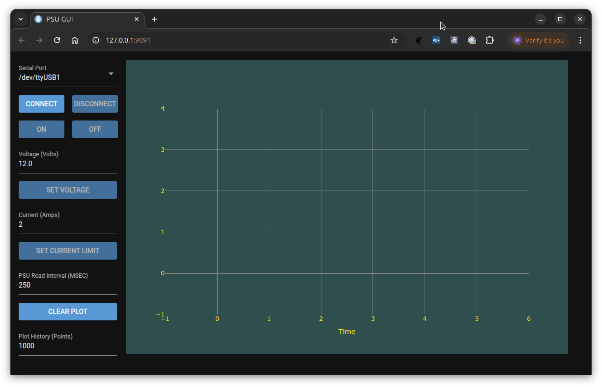
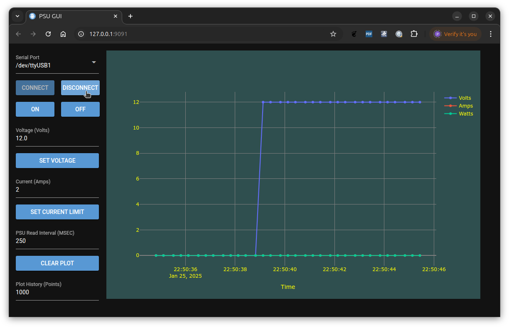

# ROCKSEED RS310P PSU control
This project provides a command line tool to control the
ETommens eTM-xxxxP Series PSU. Several Mfg's use this supply,
Hanmatek HM305P, Rockseed RS305P, Hanmatek HM310P, RockSeed RS310P,
Rockseed RS605P. See https://sigrok.org/wiki/ETommens_eTM-xxxxP_Series#Protocol for more details. The tool is written in python.

# Installation
Currently an installer is available for Linux systems. The python code should run on Windows but has not been tested and no installer currently exists for a Windows platform.

## Installing the debian package
- Download the packages/python-rs3psu-1.1-all.deb. The version (currently 1.1) of the package may change.
- Install the package from a terminal window on your machine as shown below.
```
sudo dpkg -i python-rs3psu-1.1-all.deb
```

# Running the psu command
Once installed the psu command is available on the command line. The psu command has command line help as shown below

```
psu -h
Usage: Provide a control interface to the ROCKSEED RS310P/RS305P Bench PSU.

Options:
  -h, --help     show this help message and exit
  --debug        Enable debugging.
  -g             Run the GUI.
  -p P           The local machine USB serial port connected to the PSU
                 (default=/dev/ttyUSB0) or the 'host:port' format for an Esp-
                 Link bridge.
  -v V           The required output voltage.
  -a A           The current limit value in amps.
  -s             The PSU status showing output state, voltage, current and
                 power out.
  --vs           The verbose PSU status.
  --ov=OV        The required over voltage protection value in volts
  --oa=OA        The required over current protection value in amps.
  --op=OP        The required over power protection value in watts.
  --on           Turn the PSU output on.
  --off          Turn the PSU output off.
  --bon          Set the buzzer on.
  --boff         Set the buzzer off.
  --plot         Plot the PSU status.
  --poll=POLL    The poll period in seconds (default=1).
  --log=LOG      Log file. This is used when plotting (default=/tmp/psu.log).
  --plotl        Plot the data in the log file.
  --range=RANGE  The Y axis plot range. By default the Y axis will auto range.
                 If defined then a comma separated list of min,max values is
                 required. (E.G 0,10)
```

# GUI interface
If the -g argument is used then the GUI is displayed to control the PDU.

```
psu -g
```

This displays the following GUI in a web browser tab.



The serial port that is connected to the PSU (USB cable connection must be selected.
When the On button is selected a connection is made to the PSU, the PSU is turned on (the output voltage will be that set in the 'Output Voltage' field). When the PSU is on the volts, amps and watts are plotted as shown below.



 - The voltage and current limit may be set using the set button while the PSU is on.
 - The max time that a value will remain in the plot can be set by changing the plot history field.
 - The quit button can be selected to shut down the psu application. The PSU will be turned off as the application is shut down.

If the GUI is started when the port is defined as an address:port pair if the PSU is connected to an ESP Link Bridge then the GUI shows the address:port rather than a pull down menu of local serial ports as shown Below.

```
psu -g -p 192.168.0.40:3800
```


The user can change the address or serial port from the default values set on the command line.

# Command Line Interface

Below is an example of PSU control using the command line interface.

```
psu -s
INFO:  Output:                 OFF
INFO:  Voltage (volts):        1.00
INFO:  Output voltage (volts): 0.00
INFO:  Current (amps):         0.000
INFO:  Watts (watts):          0.000

psu -s
INFO:  Output:                 OFF
INFO:  Voltage (volts):        1.00
INFO:  Output voltage (volts): 0.00
INFO:  Current (amps):         0.000
INFO:  Watts (watts):          0.000

psu -v 10
INFO:  Set output to 10.00 Volts

psu --on
INFO:  Set output ON

psu -s
INFO:  Output:                 ON
INFO:  Voltage (volts):        10.00
INFO:  Output voltage (volts): 10.00
INFO:  Current (amps):         1.622
INFO:  Watts (watts):          16.220
```

It is possible to plot the load status of the PSU output as shown below.

```
psu -p /dev/ttyUSB1 --plot
INPUT: Overwrite /tmp/psu.log y/n: y
INFO:  Deleted /tmp/psu.log
INFO:  Created /tmp/psu.log
INFO:  Log file: /tmp/psu.log
INFO:  07/04/2021-06:31:21.443879: Volts=0.0 Amps=0.0 Watts=0
INFO:  07/04/2021-06:31:22.525330: Volts=0.0 Amps=0.0 Watts=0
INFO:  07/04/2021-06:31:23.607161: Volts=0.0 Amps=0.0 Watts=0
INFO:  07/04/2021-06:31:24.688638: Volts=0.0 Amps=0.0 Watts=0
INFO:  07/04/2021-06:31:25.770133: Volts=0.0 Amps=0.0 Watts=0
INFO:  07/04/2021-06:31:26.843266: Volts=0.0 Amps=0.0 Watts=0
INFO:  07/04/2021-06:31:27.903139: Volts=5.44 Amps=0.0 Watts=0
INFO:  07/04/2021-06:31:28.983893: Volts=5.44 Amps=0.0 Watts=0
INFO:  07/04/2021-06:31:30.065649: Volts=5.44 Amps=0.0 Watts=0
INFO:  07/04/2021-06:31:31.147416: Volts=5.44 Amps=0.0 Watts=0
INFO:  07/04/2021-06:31:32.229178: Volts=5.44 Amps=0.233 Watts=1.267
INFO:  07/04/2021-06:31:33.310734: Volts=5.44 Amps=0.233 Watts=1.267
INFO:  07/04/2021-06:31:34.392418: Volts=5.44 Amps=0.233 Watts=1.267
INFO:  07/04/2021-06:31:35.474215: Volts=5.44 Amps=0.233 Watts=1.267
INFO:  07/04/2021-06:31:36.555785: Volts=5.44 Amps=0.233 Watts=1.267
INFO:  07/04/2021-06:31:37.637373: Volts=5.44 Amps=0.233 Watts=1.267
INFO:  07/04/2021-06:31:38.718189: Volts=5.44 Amps=0.234 Watts=1.272
INFO:  07/04/2021-06:31:39.800310: Volts=5.44 Amps=0.233 Watts=1.267
INFO:  07/04/2021-06:31:40.882058: Volts=5.44 Amps=0.233 Watts=1.267
INFO:  07/04/2021-06:31:41.963638: Volts=5.44 Amps=0.0 Watts=0
INFO:  07/04/2021-06:31:43.081069: Volts=0.0 Amps=0.0 Watts=0
INFO:  07/04/2021-06:31:44.159651: Volts=0.0 Amps=0.0 Watts=0
INFO:  07/04/2021-06:31:45.241097: Volts=0.0 Amps=0.0 Watts=0
INFO:  07/04/2021-06:31:46.307041: Volts=0.0 Amps=0.0 Watts=0
INFO:  Log file: /tmp/psu.log
.....
```

While the above output is displayed on in the terminal window a GUI will report the amps, volts and watts as shown below.


# Python
This software requires that python3.8 is installed on the host computer.
Python3.8 can be installed on Debian based machines using the following steps.
```
sudo apt install build-essential zlib1g-dev libncurses5-dev libgdbm-dev libnss3-dev libssl-dev libreadline-dev libffi-dev libsqlite3-dev wget curl
sudo apt install libssl-dev libffi-dev
cd /tmp
curl -O https://www.python.org/ftp/python/3.8.2/Python-3.8.2.tar.xz
tar -xf Python-3.8.2.tar.xz
cd Python-3.8.2
./configure --enable-optimizations
sudo make altinstall
```

# Building debian package

pipenv2deb must be installed in order to build this package. See https://github.com/pjaos/pipenv2deb for details.

```
sudo pipenv2deb --rpm --tgz
INFO:  Set executable attribute: create_pip_env.sh
INFO:  Created build/DEBIAN
INFO:  Created build/usr/local/bin/python-rs3psu.pipenvpkg
INFO:  Copied /scratch/git_repos/python3/rs310p_dc_psu/images to build/usr/local/bin/python-rs3psu.pipenvpkg/images
INFO:  Copied Pipfile to build/usr/local/bin/python-rs3psu.pipenvpkg
INFO:  Copied Pipfile.lock to build/usr/local/bin/python-rs3psu.pipenvpkg
INFO:  Set executable attribute: build/usr/local/bin/python-rs3psu.pipenvpkg/create_pip_env.sh
INFO:  Copied /scratch/git_repos/python3/rs310p_dc_psu/psu.py to build/usr/local/bin/python-rs3psu.pipenvpkg
INFO:  Creating build/DEBIAN/postinst
INFO:  Set executable attribute: build/DEBIAN/postinst
INFO:  Set executable attribute: build/DEBIAN/control
INFO:  Set executable attribute: build/DEBIAN/postinst
INFO:  Created: build/usr/local/bin/psu
INFO:  Set executable attribute: build/usr/local/bin/psu
INFO:  Executing: dpkg-deb -Zgzip -b build packages/python-rs3psu-1.1-all.deb
dpkg-deb: building package 'python-rs3psu' in 'packages/python-rs3psu-1.1-all.deb'.
INFO:  Executing: sudo alien --to-rpm --scripts python-rs3psu-1.1-all.deb
python-rs3psu-1.1-2.noarch.rpm generated
INFO:  Created rpm file from deb
INFO:  Executing: sudo alien --to-tgz --scripts python-rs3psu-1.1-all.deb
python-rs3psu-1.1.tgz generated
INFO:  Created tgz file from deb
INFO:  Removed build path
```

This leaves a *.deb, *.rpm and a *.tgz file in the packages folder. The installation of the *.deb and *.rpm files is detailed above. The *.tgz file could be used as the basis for an installer on other platforms (E.G  Windows).
